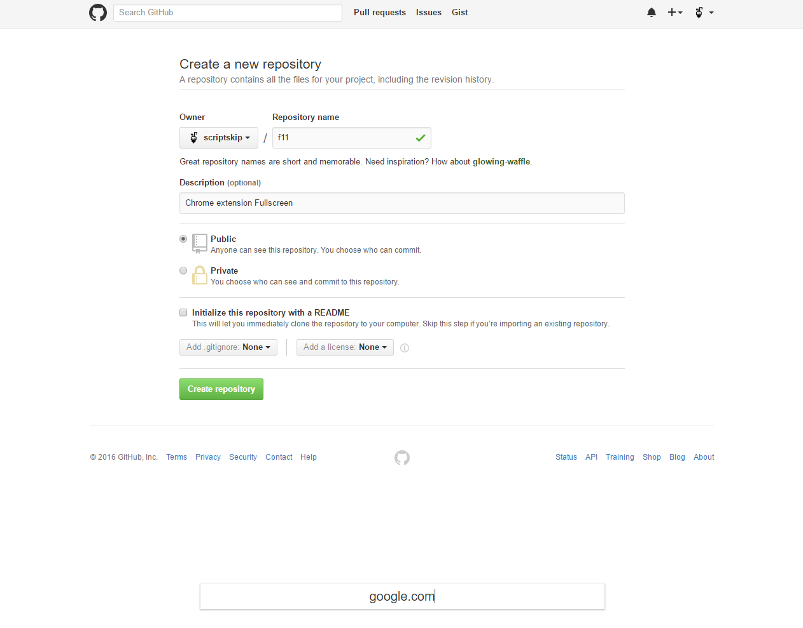

# F11
Chrome extension. It shows the command line at the bottom of the page ( autohide and autoshow )

Commands

"url" - go to url

"words" - search on Google

"/word" - get query

" night" - enable night mode on this site

" day" - disable night mode

"!url" - proxy via Google Translate

"!rus_words", "!en_words" - auto translate